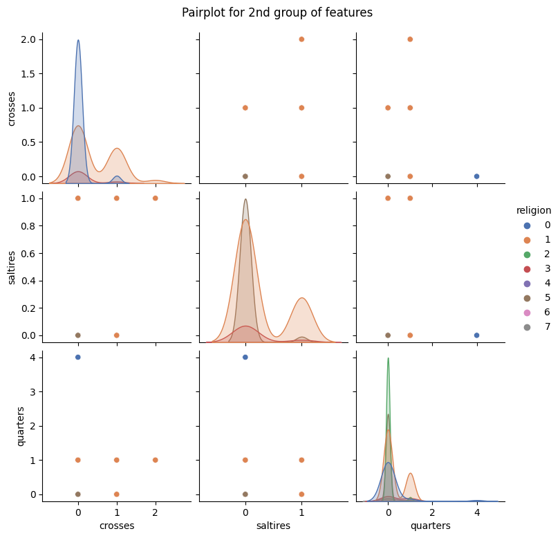

[![License][badge-mit]][license]
![Project-status][status-completed]
[![Colab][badge-colab]][colab]

Photo by <a href="https://unsplash.com/@matreding?utm_source=unsplash&utm_medium=referral&utm_content=creditCopyText">Mathias Reding</a> on <a href="https://unsplash.com/images/things/flag?utm_source=unsplash&utm_medium=referral&utm_content=creditCopyText">Unsplash</a>

<h1 align="center">Classification Flags</h1>

Building a multi-class classification model based on decision trees. From a dataset describing the flags of different countries, the model predicts the official religion of the countries.

 :hammer_and_wrench: Realised: feature engineering, feature selection, bagging, boosting, stacking.

<h2>Tech-skills:</h2>

---

The first was EDA and data features were identified, followed by the basic feature engineering and feature selection. Different models were then built, using sove variants of boosting and bagging. In the end, stacking of the best models was implemented, which did not give the best result due to data limitations. 

[status-active]: https://img.shields.io/badge/project%20status-active-brightgreen?style=for-the-badge&logo=appveyor.svg
[status-on-hold]: https://img.shields.io/badge/project%20status-on%20hold-yellow?style=for-the-badge&logo=appveyor.svg
[status-completed]: https://img.shields.io/badge/project%20status-completed-blueviolet?style=for-the-badge&logo=appveyor.svg
[status-cancelled]: https://img.shields.io/badge/project%20status-cancelled-red?style=for-the-badge&logo=appveyor.svg
[badge-mit]: https://img.shields.io/badge/License-MIT-blue?style=for-the-badge&logo=appveyor.svg
[license]: https://github.com/Fedorov-Nikita/Classification-Flags/blob/main/LICENSE.md
[badge-colab]: https://img.shields.io/badge/open%20in%20Colab-F9AB00?style=for-the-badge&logo=googlecolab&color=525252
[colab]: https://drive.google.com/file/d/1i0mPGhynKCTRuMv4AbZUcDeQK3b8ZJSE/view
